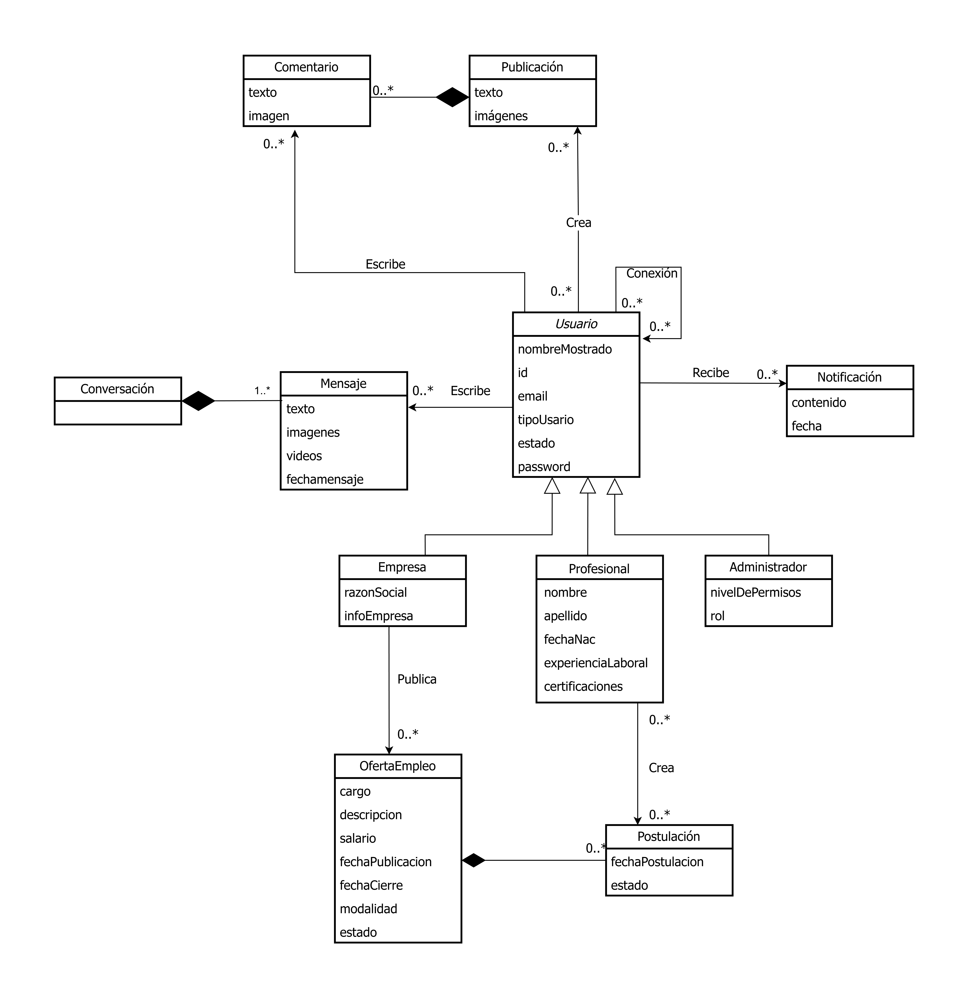
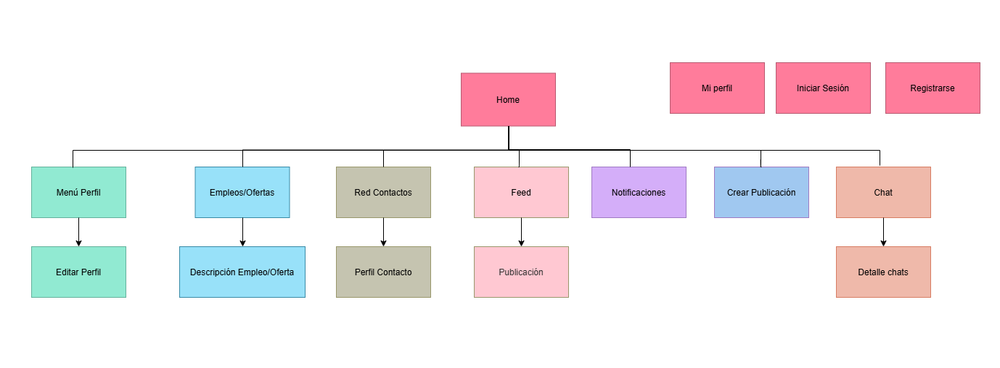
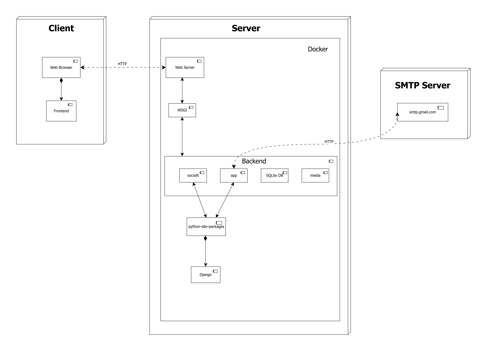

# SocialIT


> **Universidad Central de Venezuela** > **Facultad de Ciencias - Escuela de Computación** > **Materia:** Aplicaciones con Tecnología Internet  
> **Semestre:** 2025-2

## 📖 Descripción del Proyecto

Este proyecto consiste en el desarrollo de una Red Social diseñada para conectar a profesionales de ATI con otros colegas y empresas. El objetivo principal es facilitar la búsqueda de oportunidades laborales, la construcción de relaciones comerciales y el intercambio de conocimientos.

La aplicación permite la creación de perfiles (Personas y Empresas), publicación de contenido multimedia, ofertas de empleo, chat en tiempo real y gestión de postulaciones

## 🛠 Tech Stack

El desarrollo sigue una metodología ágil (Scrum adaptado) y utiliza las siguientes tecnologías:

- **Lenguaje:** Python
- **Framework Web:** Django 6.0.1
- **Base de Datos:** SQLite (Entorno de desarrollo)
- **Contenedores:** Docker & Docker Compose
- **Control de Versiones:** Git & GitHub

## ✨ Funcionalidades Principales

### 👤 Gestión de Usuarios

- Perfiles:
  - Profesionales: Información básica, resumen profesional, educación, experiencia y gustos personales.

  - Empresas: Información comercial, logo, sector, ubicación y cultura empresarial.

- Seguidores: Sistema para seguir a personas o empresas y relacionarse entre sí.

- Autenticación: Registro, inicio de sesión y recuperación de contraseña vía email.

### 📰 Interacción y Contenido (Muro)

- Publicaciones: Texto y contenido multimedia (video, audio, fotos, enlaces).

- Empleos: Publicación de ofertas laborales y sistema de postulaciones.

- Interacción: Comentarios anidados (respuestas a respuestas) en las publicaciones.

- Búsqueda: Búsqueda avanzada de usuarios (por habilidades/educación) y de publicaciones (por palabras clave).

### 💬 Comunicación y Notificaciones

- Chat: Mensajería privada entre usuarios con lista de contactos y solicitudes de chat.

- Notificaciones: Alertas vía sistema y correo electrónico sobre nuevos mensajes, comentarios o postulaciones.

### ⚙️ Requerimientos Generales y Admin

- Panel Administrativo: Moderación de usuarios, publicaciones y comentarios (bloqueo de contenido inapropiado).

- Personalización: Soporte para "Modo Oscuro" y distintos diseños.

- Diseño Adaptativo: Interfaz responsive para distintos dispositivos.

- Internacionalización (i18n): Soporte para múltiples idiomas.

### 🚀 Instalación y Despliegue con Docker

Este proyecto utiliza **Docker** para garantizar que el entorno de desarrollo sea consistente entre todos los miembros del equipo.

#### Prerrequisitos

- [Docker Engine](https://docs.docker.com/get-docker/)
- [Docker Compose](https://docs.docker.com/compose/install/)

#### Pasos para levantar el entorno (Desarrollo)

1. **Clonar el repositorio:**

   ```bash
   git clone https://github.com/Brhandon28/Red-Social-ATI.git
   cd Red-Social-ATI
   ```

2. **Construir y levantar los contenedores:**
   Este comando descargará las imágenes necesarias, instalará las dependencias definidas en el `Dockerfile` y levantará el servidor de desarrollo.

   ```bash
   docker compose up --build
   ```

3. **Aplicar migraciones (Base de Datos):**
   Una vez que el contenedor esté corriendo, abre una nueva terminal y ejecuta las migraciones para inicializar la base de datos SQLite:

   ```bash
   docker compose exec web python manage.py migrate
   ```

4. **Crear un superusuario (Admin):**
   Para acceder al panel de administración de Django:

   ```bash
   docker compose exec web python manage.py createsuperuser
   ```

5. **Acceder a la aplicación:**

- **Web:** Abre tu navegador en `http://localhost:8000`
- **Admin:** `http://localhost:8000/admin`

#### Comandos útiles de Docker

- **Detener el servidor:** Presiona `Ctrl + C` en la terminal o ejecuta:

```bash
docker compose down
```

- **Instalar una nueva dependencia:**
  Si agregas una librería a `requirements.txt`, necesitas reconstruir la imagen:

```bash
docker compose up --build
```

### 🖥 Instalación Local (Sin Docker)

Si prefieres trabajar sin Docker, puedes levantar el proyecto directamente con Python y SQLite.

#### Prerrequisitos

- [Python 3.13+](https://www.python.org/downloads/)
- pip (incluido con Python)
- gettext (via apt-get install gettext en linux, disponible en github.com/mlocati/gettext-iconv-windows para Windows)

#### Pasos

1. **Clonar el repositorio:**

   ```bash
   git clone https://github.com/Brhandon28/Red-Social-ATI.git
   cd Red-Social-ATI
   ```

2. **Crear y activar el entorno virtual:**

   ```bash
   python3 -m venv venv
   source venv/bin/activate        # macOS / Linux
   # venv\Scripts\activate         # Windows
   ```

3. **Instalar dependencias:**

   ```bash
   pip install -r requirements.txt
   ```

4. **Crear la base de datos y aplicar migraciones:**

   Esto genera el archivo `db.sqlite3` con todas las tablas del proyecto (usuarios, perfiles, permisos, grupos, logs de auditoría, etc.).

   ```bash
   python manage.py makemigrations accounts
   python manage.py migrate
   ```

5. **Aplicar internacionalización:**

Escribir las traducciones (El archivo .po):

```bash
python manage.py makemessages -l en
python manage.py makemessages -l es
```

Esto creará automáticamente un archivo de texto en esta ruta: /locale/[CodigoDeIdioma]/LC_MESSAGES/django.po

Compilar las traducciones (compilemessages):

```bash
python manage.py compilemessages
```

Este comando escaneará todas las carpetas en locale, tomará los archivos .po actualizados y generará o sobrescribirá los archivos .mo correspondientes junto a ellos

5. **Crear un superusuario (Administrador):**

   ```bash
   python manage.py createsuperuser
   ```

6. **Ejecutar el servidor de desarrollo:**

   ```bash
   python manage.py runserver
   ```

7. **Acceder a la aplicación:**
   - **Inicio:** http://localhost:8080
   - **Panel de Admin:** http://127.0.0.1:8000/admin/

9. **Inspeccionar la base de datos (opcional):**

   ```bash
   python manage.py dbshell
   ```

   Dentro del shell de SQLite:

   ```sql
   .tables                -- Ver todas las tablas
   .schema accounts_usuario   -- Ver estructura de la tabla de usuarios
   SELECT id, username, email, tipoUsuario FROM accounts_usuario;  -- Listar usuarios
   .exit                  -- Salir
   ```

#### Tablas del módulo de seguridad

| Tabla                               | Descripción                                  |
| ----------------------------------- | -------------------------------------------- |
| `accounts_usuario`                  | Usuarios del sistema (extiende AbstractUser) |
| `accounts_profesional`              | Perfil profesional (OneToOne con Usuario)    |
| `accounts_empresa`                  | Perfil empresa (OneToOne con Usuario)        |
| `accounts_administrador`            | Perfil administrador (OneToOne con Usuario)  |
| `auth_group`                        | Grupos / Roles                               |
| `auth_permission`                   | Permisos                                     |
| `accounts_usuario_groups`           | Relación Usuario ↔ Grupo                     |
| `accounts_usuario_user_permissions` | Relación Usuario ↔ Permiso                   |
| `django_admin_log`                  | Logs de auditoría                            |

---

#### Pasos para levantar el entorno (Produccion)

```bash
docker compose -f docker-compose.prod.yml up -d --build web
docker compose -f docker-compose.prod.yml exec -T web python manage.py seed_social_data
```

Integrantes del equipo:

- [Brandon Oropeza](https://github.com/BlueFox07) - Front-end
- [Brhandon Palomo](https://github.com/Brhandon28) - Back-end
- [Fidel Serpa](https://github.com/Fidel244) - Back-end
- [Jesús Hernández](https://github.com/jesusrafaell) - Full-stack
- [Ronald Herrera](https://github.com/ronaldhab) - Full-stack
- [Yunior Moreno](https://github.com/yuunichi) - Q.A.

## 📚 Documentación y Normas

### ⚠️ Antes de empezar a programar

Por favor revisa nuestras normas de contribución:

- [📘 Guía de Estilo y Buenas Prácticas](docs/STYLEGUIDE.md)
- [🐙 Política de Git y Flujo de Trabajo](docs/GITFLOW.md)

### Documentación de INCEPTION

- Diagrama de Casos de Uso

- Modelo del Dominio 


### Documentación de DESIGN

- Mapa de Navegación

-Wireframes
[Wireframes](https://www.figma.com/design/zrbZkbwCQmTyiEJQ305gL8/ProyectoATI-Wireframes?node-id=0-1&t=nNzkk0RYOAAJWtiG-1)

-Diagrama de Despliegue

-Diagrama de Clases de Analisis


## 📄 Licencia

Este proyecto se distribuye bajo la licencia **GNU General Public License v3.0 (GPLv3)**.

Esto significa que cualquier persona es libre de usar, modificar y distribuir este software, siempre y cuando las versiones derivadas mantengan la misma licencia y el código fuente esté disponible.

Puedes consultar el texto legal completo en el archivo [LICENSE](./LICENSE) o en el sitio oficial de [GNU.org](https://www.gnu.org/licenses/gpl-3.0.es.html).
